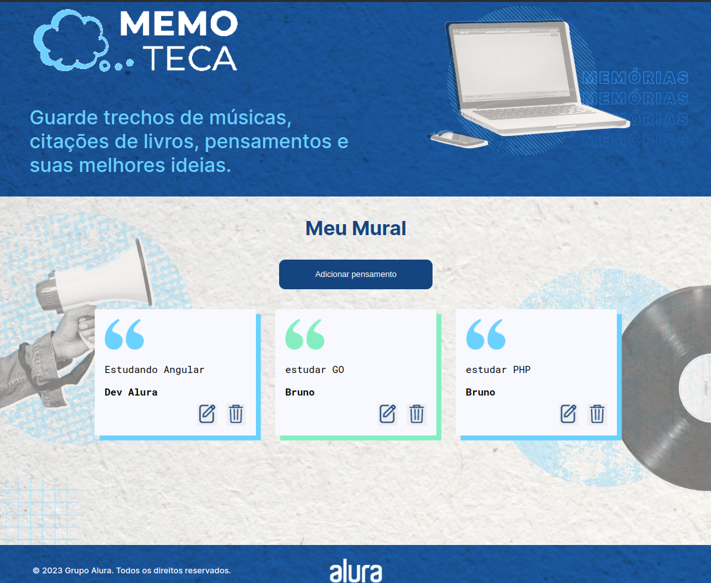

# MemoTeca

This project is the result of learning from [Alura's Angular course](https://cursos.alura.com.br/course/angular-explorando-framework) and was generated with [Angular CLI](https://github.com/angular/angular-cli) version 16.

Briefly, MemoTeca is a platform to post, edit and delete (CRUD) memories, thoughts, quotes and reflections about your life.

## Technologies used

## Development server

Run `ng serve` for a dev server, or `ng serve --open` to automatically open in your web browser. Navigate to `http://localhost:4200/`. The application will automatically reload if you change any of the source files.

## Code scaffolding

Run `ng generate component component-name` to generate a new component. You can also use `ng generate directive|pipe|service|class|guard|interface|enum|module`.

## Build

Run `ng build` to build the project. The build artifacts will be stored in the `dist/` directory.

## Running unit tests

Run `ng test` to execute the unit tests via [Karma](https://karma-runner.github.io).

## Running end-to-end tests

Run `ng e2e` to execute the end-to-end tests via a platform of your choice. To use this command, you need to first add a package that implements end-to-end testing capabilities.

## Further help

To get more help on the Angular CLI use `ng help` or go check out the [Angular CLI Overview and Command Reference](https://angular.io/cli) page.
